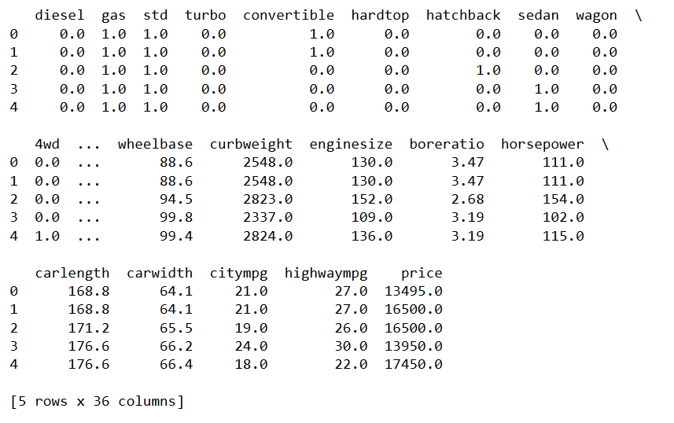
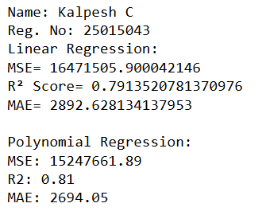
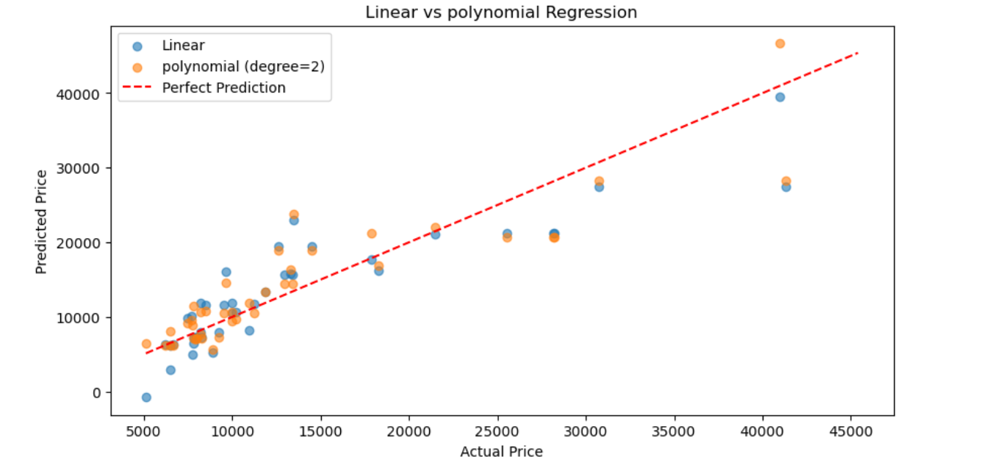

# BLENDED_LEARNING
# Implementation-of-Linear-and-Polynomial-Regression-Models-for-Predicting-Car-Prices

## AIM:
To write a program to predict car prices using Linear Regression and Polynomial Regression models.

## Equipments Required:
1. Hardware – PCs
2. Anaconda – Python 3.7 Installation / Jupyter notebook

## Algorithm
Algorithm: Linear and Polynomial Regression for Car Price Prediction

Step 1: Start

Step 2: Import required libraries
        - pandas
        - train_test_split from sklearn.model_selection
        - LinearRegression from sklearn.linear_model
        - PolynomialFeatures, StandardScaler from sklearn.preprocessing
        - Pipeline from sklearn.pipeline
        - matplotlib.pyplot

Step 3: Load the dataset
        - Read CSV file 'encoded_car_data (1).csv' into dataframe df

Step 4: Display first few rows of dataset using df.head()

Step 5: Define input and output variables
        - X = features ['enginesize', 'horsepower', 'citympg', 'highwaympg']
        - Y = target variable 'price'

Step 6: Split dataset into training and testing sets
        - Use train_test_split with test_size = 0.2 and random_state = 42

Step 7: Create Linear Regression pipeline
        - Apply StandardScaler for feature scaling
        - Apply LinearRegression model

Step 8: Train Linear Regression model
        - Fit model using X_train and Y_train

Step 9: Predict using Linear Regression
        - Predict Y_pred_linear using X_test

Step 10: Create Polynomial Regression pipeline
         - Apply PolynomialFeatures with degree = 2
         - Apply StandardScaler
         - Apply LinearRegression model

Step 11: Train Polynomial Regression model
         - Fit model using X_train and Y_train

Step 12: Predict using Polynomial Regression
         - Predict Y_pred_poly using X_test

Step 13: Visualize results
         - Create scatter plot of Y_test vs Y_pred_linear
         - Create scatter plot of Y_test vs Y_pred_poly
         - Plot a reference line for perfect prediction
         - Add labels, title, and legend

Step 14: Display the plot

Step 15: Stop


## Program:
```
import pandas as pd
from sklearn.model_selection import train_test_split
from sklearn.linear_model import LinearRegression
from sklearn.preprocessing import PolynomialFeatures, StandardScaler
from sklearn.pipeline import Pipeline
from sklearn.metrics import mean_squared_error, r2_score, mean_absolute_error
import matplotlib.pyplot as plt

df = pd.read_csv('encoded_car_data (1).csv')
print(df.head())

X = df[['enginesize','horsepower','citympg','highwaympg']]
Y = df['price']

X_train,X_test,Y_train,Y_test=train_test_split(X,Y,test_size=0.2,random_state=42)

lr=Pipeline([
('scaler', StandardScaler()),
('model',LinearRegression())
])
lr.fit(X_train,Y_train)
Y_pred_linear = lr.predict(X_test)

poly_model=Pipeline([
 ('poly',PolynomialFeatures(degree=2)),
 ('scaler',StandardScaler()),
 ('model',LinearRegression())
])
poly_model.fit(X_train,Y_train)
Y_pred_poly=poly_model.predict(X_test)

plt.figure(figsize=(10,5))
plt.scatter(Y_test,Y_pred_linear,label='Linear',alpha=0.6)
plt.scatter(Y_test,Y_pred_poly,label='polynomial (degree=2)',alpha=0.6)
plt.plot([Y.min(),Y.max()],[Y.min(),Y.max()],'r--',label='Perfect Prediction')
plt.xlabel("Actual Price")
plt.ylabel("Predicted Price")
plt.title("Linear vs polynomial Regression")
plt.legend()
plt.show()
```

## Output:
 
 



## Result:
Thus, the program to implement Linear and Polynomial Regression models for predicting car prices was written and verified using Python programming.
